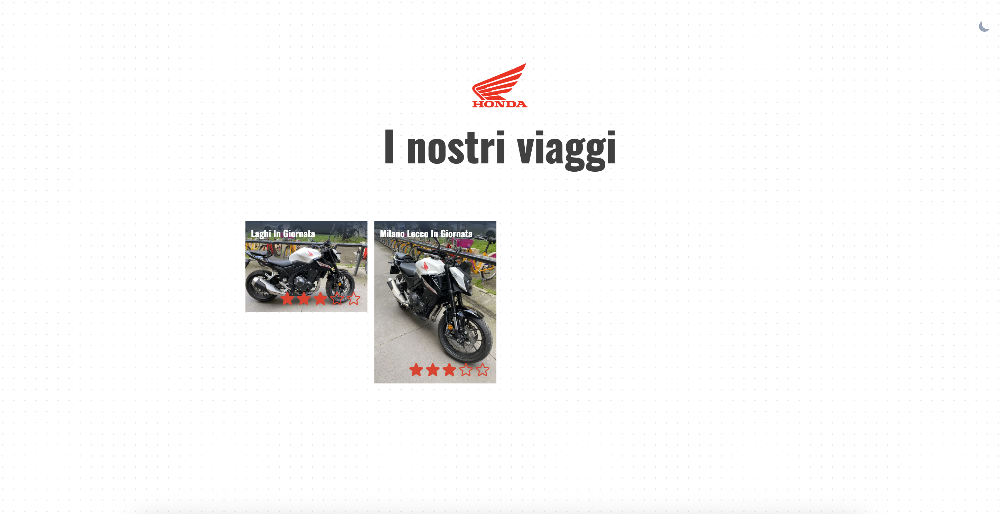
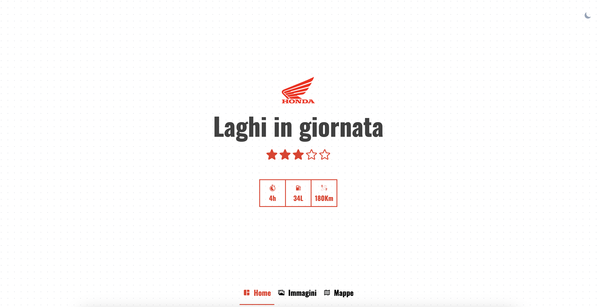
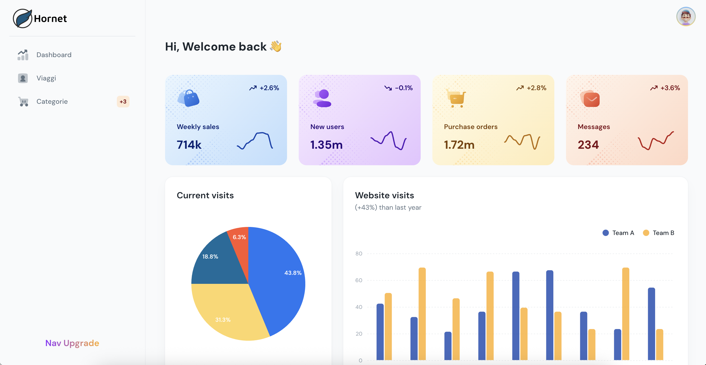

# 📍 IlMotoDiario

Un'applicazione web per salvare e gestire i propri viaggi. Puoi caricare **mappe**, **foto** e altre informazioni utili per ogni viaggio che hai fatto. Ideale per motociclisti, escursionisti e viaggiatori!

---

## ✨ Funzionalità principali

- 🗺️ Caricamento di tracce GPS (GPX)
- 📸 Upload di foto per ogni viaggio
- 📝 Descrizione, categorie e metadati
- 🔍 Interfaccia pubblica per la consultazione
- 🔐 Pannello admin per la gestione dei contenuti

---

## 📸 Screenshot

### Homepage dell'app



### Dettaglio di un viaggio



### Pannello Admin



---

## 🧱 Architettura del progetto

Il progetto è suddiviso in due ambienti: **sviluppo** e **produzione**, ognuno con un proprio file `docker-compose`.

### 🧪 Ambiente di sviluppo (`compose.dev.yml`)

Lancia i seguenti container:

- `frontend`: interfaccia pubblica in React
- `admin`: pannello di amministrazione in React
- `backend`: server Express con API REST
- `mongo`: database MongoDB

### 🚀 Ambiente di produzione (`compose.prod.yml`)

Include gli stessi servizi dell’ambiente di sviluppo più un nginx che redirecta:

- `/api`: sul container backend
- `/admin`: sul container admin
- `/`: sul container frontend

---

## 🛠️ Come avviare in locale

### 1. Clona il repository

```bash
git clone https://github.com/Aler998/hornet.git
```

Copiare i file .env.example in .env.development e popolarli
- `./frontend/.env`
- `./admin/.env`

Copiare il file .env in .env.dev
- `./.env`

Avviare il docker compose
```bash
cd hornet
make dev
```

### TODO
- [X] Popolare dati dashboard
- [X] altitudine massima
- [ ] aggiungere le categorie nel frontend
- [X] aggiungere posti visitati sul viaggio + heatmap/mappa posti visitati
- [X] aggiungere lista di viaggi da fare
- [X] velocità media sul viaggio + calcolo automatico litri
- [ ] velocità massima
- [X] export pdf del viaggio
- [X] possibilità di caricare il tracciato su maps (se possibile)
- [X] Supporto PWA
- [ ] Esporre statistiche sul frontend
- [X] Menù basso sul frontend ( home, heatmap, categorie, statistiche)
- [X] Meta OG per condivisione
- [ ] Aggiungere pubblico su trip
- [X] landing page utente tra home e viaggi
- [ ] sistema di amicizia
- [X] uniformare gli stili frontend
- [ ] uniformare stile admin
- [ ] dark mode
- [X] label dei pin nella mappa
- [X] alla modifica di un trip vengono sovrascritte le località
- [ ] pulizia dei componenti e del codice
- [X] nei todo aggiungere il link del navigatore e la durata a video
- [ ] aggiungere nome applicazione nell'env
- [X] nella dashboard la lista degli ultimi viaggi se sono tanti è infinita
- [X] trip slug legato all'utente
- [ ] gestire paginazione dei viaggi
- [X] sezione le mie moto
- [X] consumi delle mie moto
- [X] immagine profilo e copertina
- [ ] caricamento progressivo trips
- [ ] amici trovabili solo tramite id/link
- [ ] aggiungere in homepage me gli ultimi viaggi degli amici
